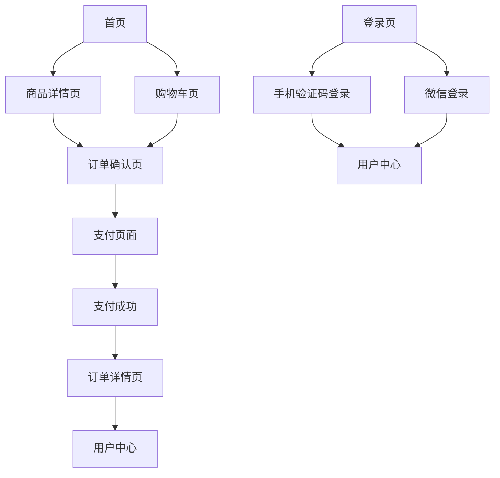

## 1. Product Overview
"爱发漂"是一个专注于Netflix等流媒体平台拼车账号销售的电商平台，为用户提供安全、实惠的账号租赁服务。通过拼车机制，用户可以以远低于官方定价的价格享受正版流媒体服务。

目标用户群体：希望以优惠价格观看Netflix等流媒体内容的个人用户，特别是学生、年轻白领等对价格敏感的消费群体。

## 2. Core Features

### 2.1 User Roles
| Role | Registration Method | Core Permissions |
|------|---------------------|------------------|
| 普通用户 | 手机验证码注册/微信登录 | 浏览商品、下单购买、查看订单、申请售后 |
| 游客用户 | 无需注册 | 浏览商品、查看商品详情 |

### 2.2 Feature Module
网站主要包含以下核心页面：
1. **首页**：Hero轮播区、热销拼车专区、独享专区、短期体验区、优势介绍、用户评价
2. **商品详情页**：商品规格选择、价格展示、库存状态、立即购买/加入购物车
3. **购物车页**：商品列表、数量修改、删除商品、结算功能
4. **订单确认页**：收货信息、支付方式选择、订单金额确认
5. **支付页面**：微信支付/支付宝支付、支付状态展示
6. **用户中心**：个人信息、订单列表、售后服务
7. **登录/注册页**：手机验证码登录、微信登录

### 2.3 Page Details
| Page Name | Module Name | Feature description |
|-----------|-------------|---------------------|
| 首页 | Hero轮播区 | 展示主打产品信息，包含"花小钱，办大事"主标题，红色CTA按钮引导用户下单 |
| 首页 | 导航栏 | 品牌Logo、首页/热销拼车/独享专区/短期体验分类导航、购物车/用户图标 |
| 首页 | 热销拼车专区 | 展示Netflix 4K拼车、HBO Max等热门拼车商品，显示价格、库存状态 |
| 首页 | 独享专区 | 展示Disney+独享账号等个人专属账号商品 |
| 首页 | 短期体验区 | 7天体验卡等短期租赁产品，降低用户尝试门槛 |
| 首页 | 优势介绍 | 价格对比、系统自动化、售后保障、稳定可靠四大核心优势展示 |
| 首页 | 用户评价 | 真实用户好评展示，增强平台可信度 |
| 商品详情页 | 商品信息展示 | 商品标题、价格、规格选择（地区/时长/人数）、库存状态显示 |
| 商品详情页 | 购买操作 | 立即上车按钮、加入购物车功能，支持商品收藏 |
| 购物车页 | 商品管理 | 显示已选商品列表，支持数量修改、商品删除操作 |
| 购物车页 | 结算功能 | 显示总金额、优惠金额，提供结算入口 |
| 订单确认页 | 订单信息 | 展示商品详情、收货联系方式、订单金额明细 |
| 订单确认页 | 支付方式 | 微信支付、支付宝支付方式选择 |
| 支付页面 | 支付操作 | 调用第三方支付接口，显示支付二维码/支付按钮 |
| 支付页面 | 支付状态 | 支付成功/失败状态展示，支付成功自动跳转订单详情 |
| 用户中心 | 个人信息 | 显示用户昵称、手机号、注册时间等基本信息 |
| 用户中心 | 订单列表 | 按状态分类展示订单（待支付/已开通/已过期），支持订单详情查看 |
| 用户中心 | 售后服务 | 提供订单售后申请入口，支持问题反馈和账号异常处理 |
| 登录/注册页 | 手机登录 | 手机号输入、验证码发送（60秒倒计时）、验证码校验 |
| 登录/注册页 | 微信登录 | 微信OAuth授权登录，自动创建账户并绑定 |

## 3. Core Process

### 用户购买流程
1. 用户浏览首页 → 选择心仪拼车商品 → 点击进入商品详情页
2. 在详情页选择规格（如Netflix 4K 1个月拼车）→ 点击"立即上车" → 进入订单确认页
3. 填写联系方式 → 选择支付方式 → 确认订单 → 进入支付页面
4. 完成支付 → 系统自动发货（或人工发货）→ 用户收到账号信息 → 开始使用
5. 用户可在个人中心查看订单状态和使用情况

### 用户登录流程
1. 用户点击登录 → 选择手机登录或微信登录
2. 手机登录：输入手机号 → 获取验证码 → 输入验证码 → 登录成功
3. 微信登录：跳转微信授权 → 同意授权 → 自动创建账户 → 登录成功

## 4. User Interface Design

### 4.1 Design Style
- **主色调**：深黑色背景（#000000）+ Netflix红色（#E50914）作为强调色
- **辅助色**：深灰色（#1A1A1A）用于卡片背景，白色（#FFFFFF）用于文字
- **按钮样式**：主要按钮采用红色填充+白色文字，次要按钮采用深灰色边框+白色文字
- **字体选择**：中文使用思源黑体/苹方，英文使用Netflix Sans，标题加粗，正文常规
- **布局风格**：全宽布局，卡片式商品展示，左右滑动轮播
- **图标风格**：线性图标，白色为主，悬停时显示红色强调

### 4.2 Page Design Overview
| Page Name | Module Name | UI Elements |
|-----------|-------------|-------------|
| 首页 | Hero轮播区 | 全屏深色背景，Netflix "N"标志半透明叠加，大标题"花小钱，办大事"（48px加粗），副标题（20px常规），红色CTA按钮（16px，圆角4px） |
| 首页 | 导航栏 | 深色背景（#0F0F0F），Logo"爱发漂"（24px加粗白色），导航链接（16px白色），右侧图标（20px白色） |
| 首页 | 商品卡片 | 深灰色背景（#1A1A1A），圆角8px，商品标题（18px白色），价格（20px红色加粗），标签（12px灰色），状态文字（14px灰色） |
| 商品详情页 | 商品展示 | 大图展示（16:9比例），标题（24px白色加粗），价格（28px红色加粗），规格选择器（白色边框，选中红色） |
| 购物车页 | 商品列表 | 左侧商品缩略图，中间商品信息（标题16px，规格14px），右侧价格和操作按钮 |
| 用户中心 | 订单列表 | 标签页切换不同状态订单，每个订单卡片显示商品、价格、状态、操作按钮 |

### 4.3 Responsiveness
- **桌面优先**：默认设计为1920px宽屏，向下适配到1024px
- **移动端适配**：768px以下切换为移动端布局，采用底部导航栏，商品卡片单列显示
- **触摸优化**：移动端增大按钮点击区域（最小44px），支持左右滑动切换商品

### 4.4 特殊交互效果
- **悬停效果**：商品卡片悬停时轻微上浮并显示阴影，按钮悬停时颜色加深
- **加载动画**：页面切换采用淡入淡出效果，商品加载使用骨架屏
- **成功反馈**：支付成功显示庆祝动画，订单状态更新有toast提示