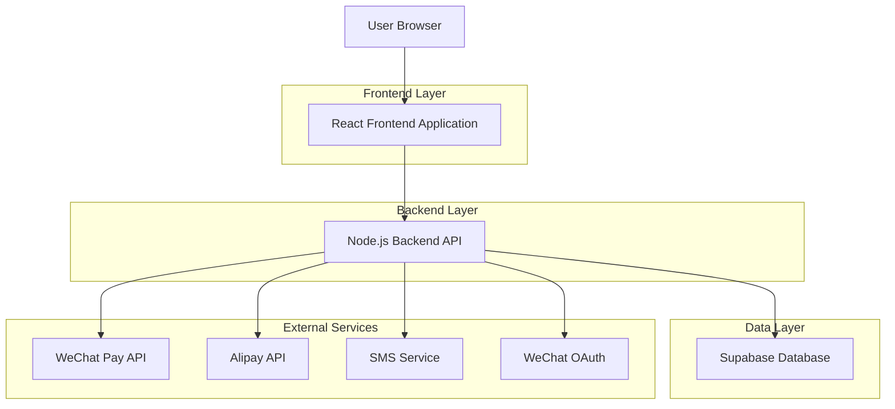
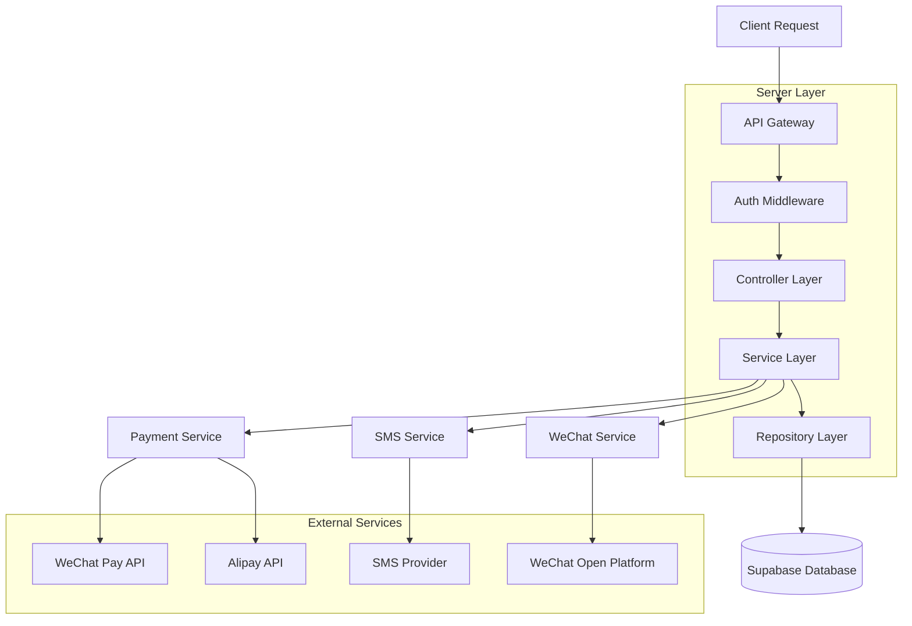
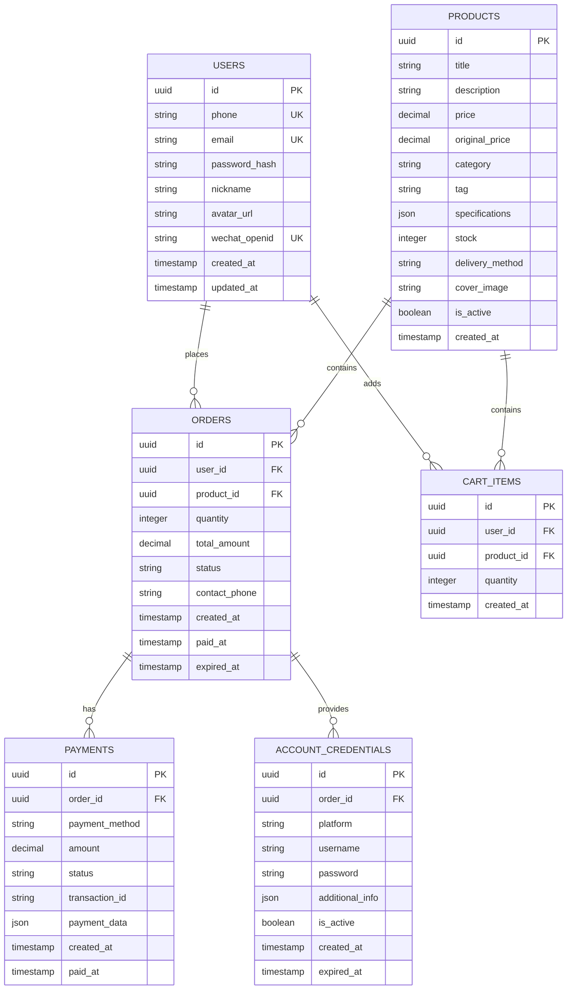

## 1. Architecture design



## 2. Technology Description

* **Frontend**: React\@18 + Tailwind CSS\@3 + Vite

* **Initialization Tool**: vite-init

* **Backend**: Node.js\@18 + Express\@4

* **Database**: Supabase (PostgreSQL)

* **Authentication**: Supabase Auth + SMS verification

* **Payment**: WeChat Pay + Alipay SDK

* **State Management**: React Context + useReducer

* **HTTP Client**: Axios

* **UI Components**: Headless UI + Custom Components

## 3. Route definitions

| Route         | Purpose             |
| ------------- | ------------------- |
| /             | 首页，展示商品推荐和主要功能入口    |
| /product/:id  | 商品详情页，显示商品详细信息和购买选项 |
| /cart         | 购物车页面，管理已选商品        |
| /checkout     | 订单确认页，填写收货信息和选择支付方式 |
| /payment      | 支付页面，处理支付流程         |
| /order/:id    | 订单详情页，显示订单状态和商品信息   |
| /user/orders  | 用户订单列表，查看历史订单       |
| /user/profile | 用户个人中心，管理个人信息       |
| /login        | 登录页面，支持手机验证码和微信登录   |
| /register     | 注册页面，手机号注册流程        |

## 4. API definitions

### 4.1 Authentication APIs

**手机验证码登录**

```
POST /api/auth/send-sms-code
```

Request:

| Param Name | Param Type | isRequired | Description |
| ---------- | ---------- | ---------- | ----------- |
| phone      | string     | true       | 手机号（11位）    |

Response:

```json
{
  "success": true,
  "message": "验证码已发送",
  "data": {
    "expire_time": 300
  }
}
```

**验证码校验和登录**

```
POST /api/auth/login-sms
```

Request:

| Param Name | Param Type | isRequired | Description |
| ---------- | ---------- | ---------- | ----------- |
| phone      | string     | true       | 手机号         |
| code       | string     | true       | 短信验证码（6位）   |

Response:

```json
{
  "success": true,
  "data": {
    "token": "eyJhbGciOiJIUzI1NiIsInR5cCI6IkpXVCJ9...",
    "user": {
      "id": "uuid",
      "phone": "13800138000",
      "nickname": "用户1234"
    }
  }
}
```

### 4.2 Product APIs

**获取商品列表**

```
GET /api/products
```

Query Parameters:

| Param Name | Param Type | isRequired | Description                    |
| ---------- | ---------- | ---------- | ------------------------------ |
| category   | string     | false      | 商品分类（hot-sale/solo/short-term） |
| page       | number     | false      | 页码，默认1                         |
| limit      | number     | false      | 每页数量，默认20                      |

Response:

```json
{
  "success": true,
  "data": {
    "products": [
      {
        "id": "prod_123",
        "title": "Netflix 4K 1个月拼车（土耳其区）",
        "price": 38,
        "original_price": 68,
        "tag": "月卡",
        "stock_status": "available",
        "stock_text": "车位有剩余",
        "cover_image": "https://cdn.example.com/netflix-4k.jpg"
      }
    ],
    "total": 50,
    "page": 1,
    "limit": 20
  }
}
```

**获取商品详情**

```
GET /api/products/:id
```

Response:

```json
{
  "success": true,
  "data": {
    "id": "prod_123",
    "title": "Netflix 4K 1个月拼车（土耳其区）",
    "description": "享受Netflix 4K超高清画质，支持4人同时在线观看",
    "price": 38,
    "specifications": {
      "region": "土耳其",
      "quality": "4K",
      "duration": "1个月",
      "max_users": 4
    },
    "stock": 15,
    "delivery_method": "automatic",
    "estimated_delivery_time": "1-5分钟"
  }
}
```

### 4.3 Order APIs

**创建订单**

```
POST /api/orders
```

Request Headers:

```
Authorization: Bearer {token}
```

Request:

| Param Name     | Param Type | isRequired | Description |
| -------------- | ---------- | ---------- | ----------- |
| product\_id    | string     | true       | 商品ID        |
| quantity       | number     | true       | 购买数量        |
| contact\_phone | string     | true       | 联系电话        |

Response:

```json
{
  "success": true,
  "data": {
    "order_id": "order_123456",
    "total_amount": 38,
    "payment_method": "wechat",
    "expire_time": 1800
  }
}
```

**获取订单列表**

```
GET /api/orders
```

Query Parameters:

| Param Name | Param Type | isRequired | Description                |
| ---------- | ---------- | ---------- | -------------------------- |
| status     | string     | false      | 订单状态（pending/paid/expired） |
| page       | number     | false      | 页码，默认1                     |

Response:

```json
{
  "success": true,
  "data": {
    "orders": [
      {
        "id": "order_123456",
        "product_title": "Netflix 4K 1个月拼车",
        "total_amount": 38,
        "status": "paid",
        "status_text": "已开通",
        "created_at": "2024-01-15T10:30:00Z",
        "expired_at": "2024-02-15T10:30:00Z"
      }
    ],
    "total": 5
  }
}
```

### 4.4 Payment APIs

**发起支付**

```
POST /api/payments/create
```

Request Headers:

```
Authorization: Bearer {token}
```

Request:

| Param Name      | Param Type | isRequired | Description         |
| --------------- | ---------- | ---------- | ------------------- |
| order\_id       | string     | true       | 订单ID                |
| payment\_method | string     | true       | 支付方式（wechat/alipay） |

Response:

```json
{
  "success": true,
  "data": {
    "payment_id": "pay_123456",
    "qr_code": "weixin://wxpay/bizpayurl?pr=123456",
    "expire_time": 1200
  }
}
```

**查询支付状态**

```
GET /api/payments/:id/status
```

Response:

```json
{
  "success": true,
  "data": {
    "status": "paid",
    "paid_at": "2024-01-15T10:35:00Z"
  }
}
```

## 5. Server architecture diagram



## 6. Data model

### 6.1 Data model definition



### 6.2 Data Definition Language

**用户表 (users)**

```sql
-- 创建用户表
CREATE TABLE users (
    id UUID PRIMARY KEY DEFAULT gen_random_uuid(),
    phone VARCHAR(11) UNIQUE,
    email VARCHAR(255) UNIQUE,
    password_hash VARCHAR(255),
    nickname VARCHAR(100) NOT NULL,
    avatar_url TEXT,
    wechat_openid VARCHAR(100) UNIQUE,
    created_at TIMESTAMP WITH TIME ZONE DEFAULT NOW(),
    updated_at TIMESTAMP WITH TIME ZONE DEFAULT NOW()
);

-- 创建索引
CREATE INDEX idx_users_phone ON users(phone);
CREATE INDEX idx_users_wechat_openid ON users(wechat_openid);
```

**商品表 (products)**

```sql
-- 创建商品表
CREATE TABLE products (
    id UUID PRIMARY KEY DEFAULT gen_random_uuid(),
    title VARCHAR(255) NOT NULL,
    description TEXT,
    price DECIMAL(10,2) NOT NULL,
    original_price DECIMAL(10,2),
    category VARCHAR(50) NOT NULL CHECK (category IN ('hot-sale', 'solo', 'short-term')),
    tag VARCHAR(20),
    specifications JSONB,
    stock INTEGER DEFAULT 0,
    delivery_method VARCHAR(20) DEFAULT 'automatic',
    cover_image TEXT,
    is_active BOOLEAN DEFAULT true,
    created_at TIMESTAMP WITH TIME ZONE DEFAULT NOW()
);

-- 创建索引
CREATE INDEX idx_products_category ON products(category);
CREATE INDEX idx_products_is_active ON products(is_active);
```

**订单表 (orders)**

```sql
-- 创建订单表
CREATE TABLE orders (
    id UUID PRIMARY KEY DEFAULT gen_random_uuid(),
    user_id UUID NOT NULL REFERENCES users(id),
    product_id UUID NOT NULL REFERENCES products(id),
    quantity INTEGER NOT NULL DEFAULT 1,
    total_amount DECIMAL(10,2) NOT NULL,
    status VARCHAR(20) NOT NULL DEFAULT 'pending' CHECK (status IN ('pending', 'paid', 'expired', 'refunded')),
    contact_phone VARCHAR(11) NOT NULL,
    created_at TIMESTAMP WITH TIME ZONE DEFAULT NOW(),
    paid_at TIMESTAMP WITH TIME ZONE,
    expired_at TIMESTAMP WITH TIME ZONE
);

-- 创建索引
CREATE INDEX idx_orders_user_id ON orders(user_id);
CREATE INDEX idx_orders_status ON orders(status);
CREATE INDEX idx_orders_created_at ON orders(created_at DESC);
```

**支付表 (payments)**

```sql
-- 创建支付表
CREATE TABLE payments (
    id UUID PRIMARY KEY DEFAULT gen_random_uuid(),
    order_id UUID NOT NULL REFERENCES orders(id),
    payment_method VARCHAR(20) NOT NULL CHECK (payment_method IN ('wechat', 'alipay')),
    amount DECIMAL(10,2) NOT NULL,
    status VARCHAR(20) NOT NULL DEFAULT 'pending' CHECK (status IN ('pending', 'paid', 'failed')),
    transaction_id VARCHAR(100),
    payment_data JSONB,
    created_at TIMESTAMP WITH TIME ZONE DEFAULT NOW(),
    paid_at TIMESTAMP WITH TIME ZONE
);

-- 创建索引
CREATE INDEX idx_payments_order_id ON payments(order_id);
CREATE INDEX idx_payments_transaction_id ON payments(transaction_id);
```

**账号凭证表 (account\_credentials)**

```sql
-- 创建账号凭证表
CREATE TABLE account_credentials (
    id UUID PRIMARY KEY DEFAULT gen_random_uuid(),
    order_id UUID NOT NULL REFERENCES orders(id),
    platform VARCHAR(50) NOT NULL,
    username VARCHAR(255) NOT NULL,
    password VARCHAR(255) NOT NULL,
    additional_info JSONB,
    is_active BOOLEAN DEFAULT true,
    created_at TIMESTAMP WITH TIME ZONE DEFAULT NOW(),
    expired_at TIMESTAMP WITH TIME ZONE
);

-- 创建索引
CREATE INDEX idx_credentials_order_id ON account_credentials(order_id);
CREATE INDEX idx_credentials_platform ON account_credentials(platform);
CREATE INDEX idx_credentials_is_active ON account_credentials(is_active);
```

**初始数据插入**

```sql
-- 插入示例商品数据
INSERT INTO products (title, description, price, original_price, category, tag, specifications, stock, delivery_method, cover_image) VALUES
('Netflix 4K 1个月拼车（土耳其区）', '享受Netflix 4K超高清画质，支持4人同时在线观看，土耳其区内容更丰富', 38.00, 68.00, 'hot-sale', '月卡', '{"region": "土耳其", "quality": "4K", "duration": "1个月", "max_users": 4}', 50, 'automatic', 'https://cdn.example.com/netflix-4k.jpg'),
('Netflix Premium 4K 季卡车位', 'Netflix Premium账号季卡拼车，更优惠的价格享受高品质内容', 98.00, 158.00, 'hot-sale', '季卡', '{"region": "全球", "quality": "4K", "duration": "3个月", "max_users": 4}', 30, 'automatic', 'https://cdn.example.com/netflix-premium.jpg'),
('Netflix 基础版 7天体验（单人）', '低成本体验Netflix内容，适合首次尝试的用户', 10.00, 25.00, 'short-term', '短期', '{"region": "全球", "quality": "HD", "duration": "7天", "max_users": 1}', 100, 'automatic', 'https://cdn.example.com/netflix-basic.jpg'),
('HBO Max 5人车车位（半年付）', 'HBO Max平台拼车账号，独享热门美剧和电影内容', 178.00, 298.00, 'hot-sale', '半年卡', '{"region": "美国", "quality": "4K", "duration": "6个月", "max_users": 5}', 20, 'manual', 'https://cdn.example.com/hbo-max.jpg'),
('Disney+ 独享账号（年付）', 'Disney+个人独享账号，包含迪士尼、漫威、星战等独家内容', 324.00, 498.00, 'solo', '年卡', '{"region": "全球", "quality": "4K", "duration": "12个月", "max_users": 1}', 15, 'manual', 'https://cdn.example.com/disney-plus.jpg');
```

## 7. Security Configuration

### 7.1 Supabase RLS Policies

```sql
-- 启用RLS
ALTER TABLE users ENABLE ROW LEVEL SECURITY;
ALTER TABLE orders ENABLE ROW LEVEL SECURITY;
ALTER TABLE payments ENABLE ROW LEVEL SECURITY;
ALTER TABLE account_credentials ENABLE ROW LEVEL SECURITY;

-- 用户只能查看自己的数据
CREATE POLICY "Users can view own profile" ON users
    FOR SELECT USING (auth.uid() = id);

-- 用户只能查看自己的订单
CREATE POLICY "Users can view own orders" ON orders
    FOR SELECT USING (auth.uid() = user_id);

-- 用户只能查看自己的支付记录
CREATE POLICY "Users can view own payments" ON payments
    FOR SELECT USING (EXISTS (
        SELECT 1 FROM orders 
        WHERE orders.id = payments.order_id 
        AND orders.user_id = auth.uid()
    ));

-- 用户只能查看自己的账号凭证
CREATE POLICY "Users can view own credentials" ON account_credentials
    FOR SELECT USING (EXISTS (
        SELECT 1 FROM orders 
        WHERE orders.id = account_credentials.order_id 
        AND orders.user_id = auth.uid()
    ));
```

### 7.2 API Security

* **Rate Limiting**: 每个IP每分钟最多发送5次短信验证码

* **JWT Token**: 使用RS256算法签名，有效期24小时

* **CORS**: 只允许配置的域名访问API

* **Input Validation**: 所有输入参数都需要验证和清理

* **SQL Injection**: 使用参数化查询，禁止字符串拼接SQL

* **XSS Protection**: 所有用户输入都需要转义输出

